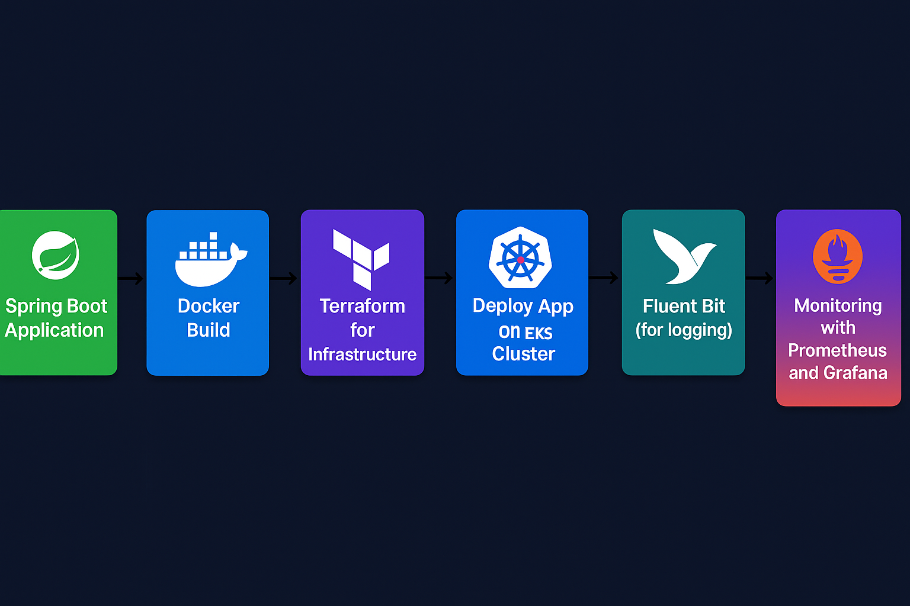

# 🚀 SpringBoot-EKS-DevOps-Demo

> A **complete DevOps pipeline** demonstrating the build, containerization, deployment, and monitoring of a Spring Boot CRUD REST API on AWS EKS — fully automated with Terraform and GitHub Actions.

---

## 🌟 **Project Overview**

This repository captures the end-to-end DevOps workflow I implemented during my internship, including:

- 🛠️ Developed a **Java Spring Boot REST API** with CRUD operations, leveraging ChatGPT assistance  
- 🐳 Created a **Dockerfile** to containerize the application  
- ⚙️ Used **Terraform** to provision AWS infrastructure: EKS cluster, node groups, and a jump server  
- 🔧 Installed `kubectl` on the jump server via user data script to manage the Kubernetes cluster  
- 📄 Created Kubernetes manifests (`deployment.yaml` & `service.yaml`) to deploy the app on EKS  
- 🔄 Built a **GitHub Actions CI/CD pipeline** to:  
  - Build Docker images  
  - Push images to Amazon ECR  
  - Deploy Kubernetes manifests automatically  
- 🔐 Accessed the EKS cluster securely via the jump server  
- 📡 Installed **Fluent Bit** for centralized logging, forwarding container logs to AWS CloudWatch  
- 📊 Deployed **Prometheus & Grafana** with Helm charts and imported dashboards for comprehensive monitoring  
- ✅ Successfully accessed and tested the live Spring Boot application running on Kubernetes  

---

## 🛠️ **Detailed Workflow**

### 1️⃣ Spring Boot REST API Development  
Built a fully functional CRUD REST API using Java Spring Boot framework.

### 2️⃣ Docker Image Creation  
Wrote a `Dockerfile` to package the Spring Boot app into a Docker container image.

### 3️⃣ Infrastructure Provisioning with Terraform  
- Provisioned a highly available EKS cluster with managed node groups  
- Created a jump server EC2 instance with `kubectl` pre-installed for cluster management  

### 4️⃣ Kubernetes Deployment Manifests  
Defined and applied Kubernetes manifests (`deployment.yaml` & `service.yaml`) to deploy the application.

### 5️⃣ GitHub Actions CI/CD Pipeline  
Automated the entire workflow including:  
- Docker image build  
- Pushing image to Amazon ECR  
- Deploying manifests to EKS cluster

### 6️⃣ Secure Cluster Access  
Utilized the jump server to access and manage the Kubernetes environment securely.

### 7️⃣ Centralized Logging Setup  
Installed Fluent Bit via Helm to capture and forward container logs into AWS CloudWatch Logs.

### 8️⃣ Monitoring with Prometheus & Grafana  
Deployed Prometheus and Grafana using Helm charts, and imported custom dashboards to monitor cluster and app metrics effectively.

---

## 🛠️ Technologies & Tools Used

| Technology      | Purpose                         |
|-----------------|--------------------------------|
| Java Spring Boot | REST API development           |
| Docker          | Containerization               |
| Terraform       | Infrastructure as Code (IaC)   |
| AWS EKS         | Managed Kubernetes cluster     |
| EC2 Jump Server | Secure cluster access          |
| Kubernetes      | Container orchestration        |
| GitHub Actions  | CI/CD automation               |
| Amazon ECR      | Docker image registry          |
| Fluent Bit      | Log forwarding to CloudWatch   |
| AWS CloudWatch  | Centralized logging and metrics|
| Helm            | Kubernetes package manager     |
| Prometheus      | Monitoring                    |
| Grafana         | Visualization and dashboards   |
